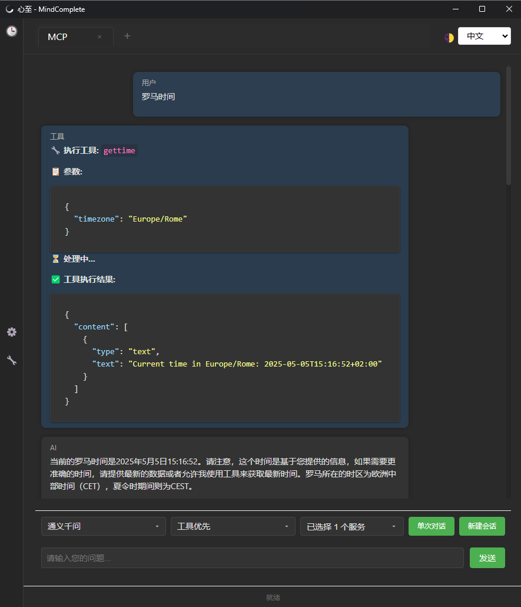

# 概述

心至(mindcomplete) 是一个简单、自由的跨平台大模型客户端应用，支持大模块流式对话和MCP调用。致力于让普通人也能更简单地使用大模型和MCP，支持自动化安装MCP运行环境，自动下载MCP服务。无须门槛，即装即用，不需要再关注复杂的环境、配置、参数。目标是让每个人都能自由地和数字世界进行交互，让技术作为工具，而不是限制我们的交互。




# 功能介绍

## 已发布

* 大模型对话
  * 支持OpenAI兼容接口
  * 支持大模型流式会话
  * 支持单次和多轮对话
* MCP应用
  * 支持本地MCP服务调用
  * 支持MCP工具调用授权
  * 支持MCP运行环境管理，自动安装，首次安装自动安装运行环境
* 会话
  * 支持对话内容Markdown格式渲染，代码渲染
  * 支持会话历史记录
  * 支持多标签对话
* 配置管理
  * 模型、提示词、MCP服务配置添加、修改、删除、复制
  * MCP服务测试、工具授权管理
  * 支持导入导出
* 外观
  * 深色/浅色模式

## 开发中…

* [ ] 支持多系统打包、安装、部署
* [ ] 支持Agent配置和对话
* [ ] 支持Agent Team配置和对话
* [ ] 支持配置管理作为MCP服务
* [ ] 支持MCP提示词、资源
* [ ] 支持开放端口访问
* [ ] 直接进行MCP调用

# 安装和运行

```bash
git clone https://github.com/skydroplet/mindcomplete.git
cd mindcomplete

# 安装依赖
npm install

# 运行
npm start
```

# 开发环境

Node js：v22.14.0

# 联系方式

- 邮箱：skydroplet@qq.com
- GitHub：[skydroplet](https://github.com/skydroplet)
- 项目主页：[MindComplete](https://github.com/skydroplet/mindcomplete)

# 许可证

本项目采用 GPL-3.0 许可证 - 详见 [LICENSE](LICENSE) 文件

# 贡献

欢迎提交 Issue 和 Pull Request！
