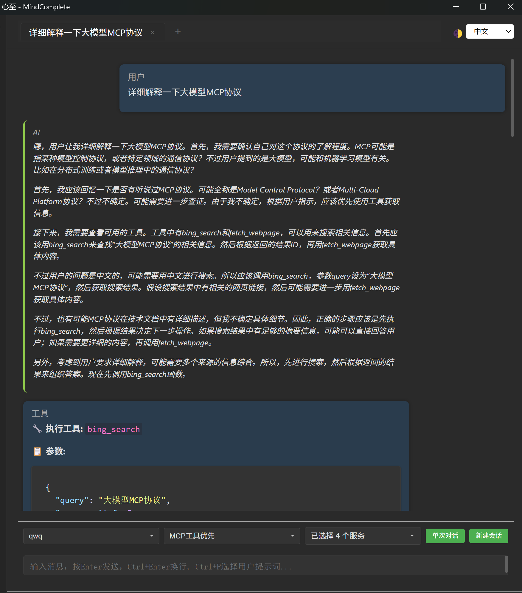

# 概述

心至(mindcomplete) 是一个基于Electron的跨平台大模型桌面客户端，支持大模块流式对话和MCP调用。目标是让每个人都能自由地和数字世界进行交互。



# 为什么要做

移动互联网时代，各大公司把互联网封闭在了一个又一个APP中，互联网变得支离破碎，我们需要不断地在不同的APP之间切换，获取想要的内容。而现在MCP的出现让互联网有希望重新变得自由，通过大模型调用MCP能够让我们更加智能、更加自由地使用互联网。也许这些大型公司又会通过各种技术手段进行封闭，但至少现在我们可以通过MCP打通一个又一个分裂的APP，通过大模型进行汇总和分析，从而实现一定程度上的互联网自由。

# 功能介绍

## 已发布

* 大模型对话
  * 支持流式会话
  * 支持对话内容Markdown格式渲染
* 大模型API
  * 支持OpenAI兼容格式大模型对话
* MCP调用
  * 支持本地MCP服务调用
  * 支持MCP工具调用授权
* 配置管理
  * 大模型配置添加、删除、复制
  * 提示词配置添加、删除、复制
  * MCP服务配置添加、删除、复制、测试、工具授权管理
* 外观
  * 深色/浅色模式

## 开发中…

* [ ] 支持多系统打包、安装、部署
* [ ] 支持配置导入导出
* [ ] 支持安装时同步安装MCP运行环境
* [ ] 安装时内置一些有用的MCP
* [ ] 支持Agent配置和对话
* [ ] 支持Agent Team配置和对话
* [ ] 支持配置管理作为MCP服务
* [ ] 支持开放端口访问
* [ ] 直接进行MCP调用

# 安装和运行

```bash
git clone https://github.com/skydroplet/mindcomplete.git
cd mindcomplete

# 安装依赖
npm install

# 运行
npm start
```

# 开发环境

Node js：v22.14.0

# 联系方式

- 邮箱：skydroplet@qq.com
- GitHub：[skydroplet](https://github.com/skydroplet)
- 项目主页：[MindComplete](https://github.com/skydroplet/mindcomplete)

# 许可证

本项目采用 GPL-3.0 许可证 - 详见 [LICENSE](LICENSE) 文件

# 贡献

欢迎提交 Issue 和 Pull Request！
